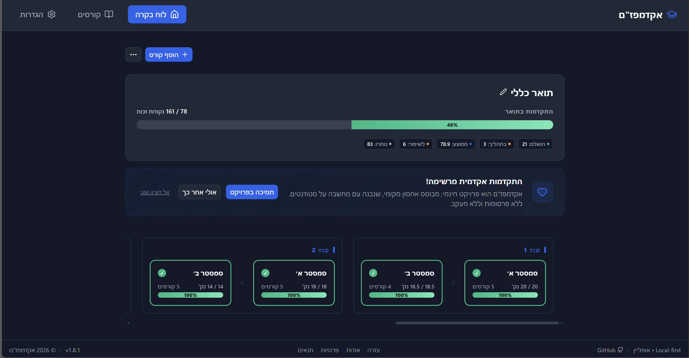
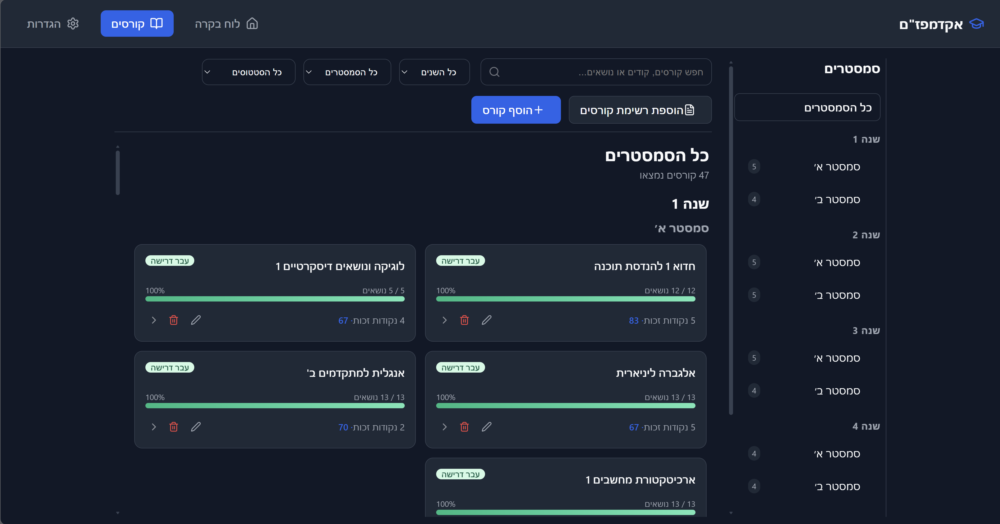
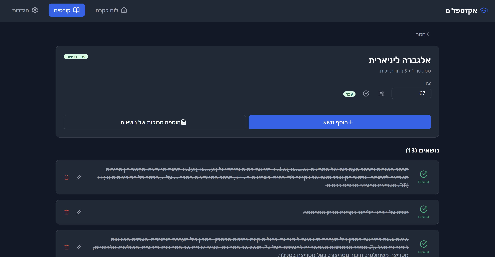
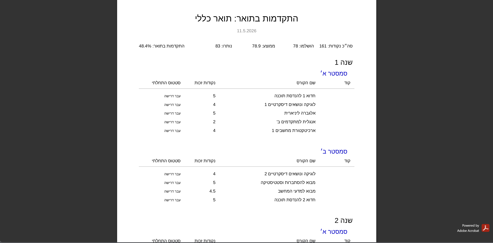

# 🎓 AcademPazam

**AcademPazam** is a professional, local-first degree progress tracker designed for students who value privacy and efficiency. Built as a Progressive Web App (PWA), it allows you to manage courses, track credits, and plan your academic journey directly on your device — even without an internet connection.

[](https://oleg-magit.github.io/academpazam-app/)

---

## 🖼️ Screenshots

AcademPazam supports a full RTL/BiDi academic planning experience, including Hebrew UI, dark mode, course progress tracking, detailed course pages, and PDF export.

| Dashboard Overview | Course List |
|---|---|
|  |  |

| Course Details | PDF Export |
|---|---|
|  |  |

---

## 🎯 Why I Built This

Many students track their degree progress using spreadsheets, notes, or scattered university portals.  
AcademPazam was built to give students a clearer and more private way to plan their academic path.

The project focuses on:

- Local-first storage, so student data stays on the device.
- Offline availability through PWA fundamentals.
- Hebrew, English, and Russian support, including RTL/BiDi layout handling.
- Academic progress tracking by courses, credits, grades, semesters, and topics.
- Practical export options such as JSON backup/restore and PDF reports.

## ✨ Key Features

- **🛡️ Privacy First** – No accounts, no tracking, and no cloud syncing. All your data stays in your browser's IndexedDB.
- **📱 PWA Ready** – Install it on your mobile device or desktop for a native App experience with offline support.
- **📑 Multi-Language & BiDi** – Full support for English, Hebrew, and Russian, including RTL (Right-to-Left) layout optimization.
- **📄 Professional PDF Export** – Generate beautiful progress reports in PDF format with full Hebrew and Cyrillic support.
- **⚡ Bulk Course Entry** – Save time by pasting course lists directly from your university portal.
- **💾 Data Portability** – Effortlessly backup your data to JSON and restore it at any time with Merge or Replace options.
- **🎨 Dynamic Themes** – Sleek Dark and Light modes tailored for comfortable academic planning.

---

## 🛠️ Tech Stack

- **Core**: [React 19](https://react.dev/) + [TypeScript](https://www.typescriptlang.org/)
- **Build Tool**: [Vite](https://vitejs.dev/)
- **PWA**: [Vite PWA Plugin](https://vite-pwa-org.netlify.app/)
- **Database**: [IndexedDB](https://developer.mozilla.org/en-US/docs/Web/API/IndexedDB_API) (via `idb`)
- **PDF Generation**: [pdf-lib](https://pdf-lib.js.org/) + [@pdf-lib/fontkit](https://github.com/Hopding/fontkit)
- **Icons**: [Lucide React](https://lucide.dev/)
- **Styling**: Vanilla CSS with Modern Variables

---

## 🚀 Getting Started

### Prerequisites
- [Node.js](https://nodejs.org/) (v18+)
- [npm](https://www.npmjs.com/)

### Installation
1. Clone the repository:
   ```bash
   git clone https://github.com/oleg-magit/academpazam-app.git
   cd academpazam-app
   ```
2. Install dependencies:
   ```bash
   npm install
   ```
3. Start development server:
   ```bash
   npm run dev
   ```

### Production Build
To create a production-ready bundle:
```bash
npm run build
```
To preview the build locally:
```bash
npm run preview
```
### Run tests

```bash
npm run test:run
```
```md
### Run full project check
```
```bash
npm run check
```
---

## 🌍 Deployment

The application is optimized for **GitHub Pages**. The production build includes a specialized Service Worker configuration to handle subpath routing and SPA navigation correctly.

---

## 🔒 Privacy & Data Policy

**AcademPazam** is a 100% "Local-First" application.
- **No Backend**: There is no remote database.
- **No Analytics**: We do not track your usage or collect telemetry.
- **Your Data, Your Control**: You are the sole owner of your data. We recommend using the **Backup** feature regularly to ensure you never lose your progress.

---

## 📜 License

Distributed under the **MIT License**. See `LICENSE` for more information.

Developed with ❤️ for students by [Oleg-Magit](https://github.com/oleg-magit).
